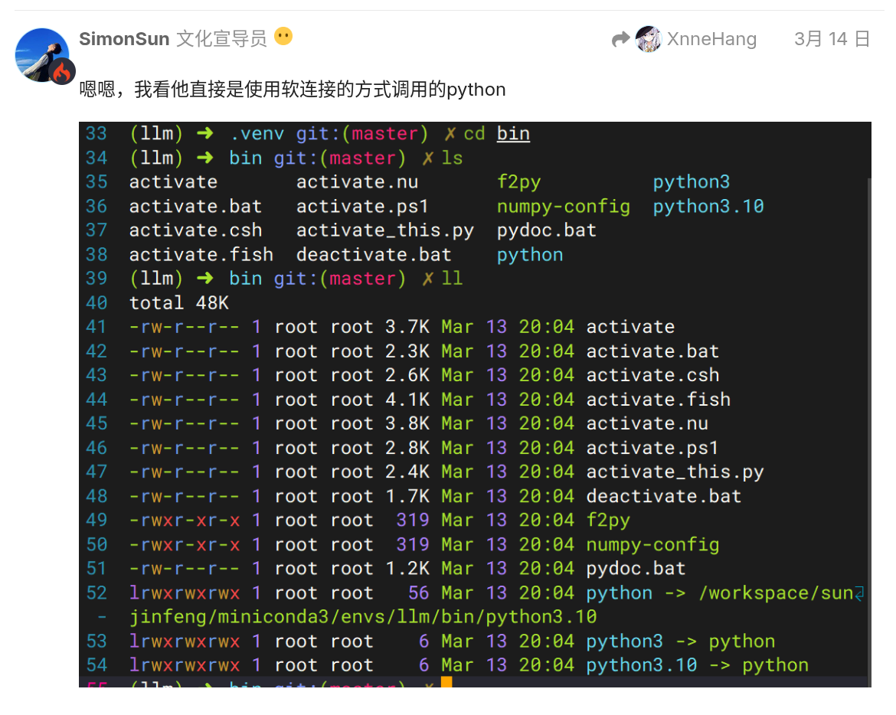

<h1 align="center">使用 python-install-mirror 从镜像源下载 python</h1>

**venv 下的 python 只是一个软连接**



问题发生在我试图像以前打包包含 conda env 的整合包的时候, 并且传播给别人时, 用户在运行 `.bat` 文件时, 试图从我的系统路径里寻找 python:

```shell
C:\Users\Administrator\Pictures\yutto-uiya-v1.1.4-pre>.\uv\uv.exe run streamlit run .\src\uiya\yutto_uiya.py
error: Querying Python at `C:\Users\Administrator\Pictures\yutto-uiya-v1.1.4-pre\.venv\Scripts\python.exe` failed with exit status exit code: 103
[stderr] did not find executable at 'C:\Users\Zhouyuan\AppData\Roaming\uv\python\cpython-3.13.2-windows-x86_64-none\python.exe': ???????????                                                                                                                                                                  C:\Users\Administrator\Pictures\yutto-uiya-v1.1.4-pre>pause
```

所以， 即使压缩了整个 `venv` 然后传递给别人, 也无法正常使用, 而 `uv` 使用 python 软链接几乎不可动摇。而且我也不希望再维护一个 conda env。 而用户在 `uv· 自动安装 python 和依赖的时候， 需要连接外网， 必然是会存在网络不可达的情况的。

那么，如何把自己写好的项目传递给那些可能网络上存在障碍的用户呢？ 答案是使用镜像源。

对于 python 包, 我们可以用 `[[tool.uv.index]]` 来替换 pypi 为清华源, 具体参考其他章节。

而对于 python_build_stand_alone, 我们也可以使用镜像, 不过藏得相当深。

参考:

- [官方文档中的 python-install-mirror 词条](https://docs.astral.sh/uv/reference/settings/#python-install-mirror)

- [我们将要使用的镜像源](https://github.com/tuna/issues/issues/2125)

可以得知, 我们可以简单地在 `pyproject.toml` 中加上这么一段来替换 python 镜像.

```toml
[tool.uv]
# 下载 Python 的镜像
python-install-mirror = "https://github.com/astral-sh/python-build-standalone/releases/download" # 使用官方的镜像, 直接从 github 安装, 需要连接外网, 官方默认配置
# python-install-mirror = "https://mirror.nju.edu.cn/github-release/indygreg/python-build-standalone/" # 使用南京大学的镜像, 可能需要更新 uv 到新版本.
```

目前似乎只有南京源支持 `python-install-mirror` , 清华源似乎没有计划支持它.
